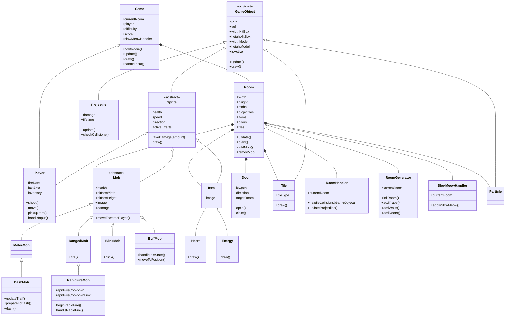

```mermaid

classDiagram
    class Game {
        +currentRoom
        +player
        +difficulty
        +score
        +slowMeowHandler
        +nextRoom()
        +update()
        +draw()
        +handleInput()
    }

    class GameObject {
        <<abstract>>
        +pos
        +vel
        +widthHitBox
        +heightHitBox
        +widthModel
        +heightModel
        +isActive
        +update()
        +draw()
    }

    class Sprite {
        <<abstract>>
        +health
        +speed
        +direction
        +activeEffects
        +takeDamage(amount)
        +draw()
    }

    class Player {
        +fireRate
        +lastShot
        +inventory
        +shoot()
        +move()
        +pickupItem()
        +handleInput()
    }

    class Mob {
        <<abstract>>
        +health
        +hitBoxWidth
        +hitBoxHeight
        +image
        +damage
        +moveTowardsPlayer()
    }

    class MeleeMob {
    }

    class RangedMob {
        +fire()
    }

    class BlinkMob {
        +blink()
    }

    class BuffMob {
        +handleIdleState()
        +moveToPosition()
    }

    class DashMob {
        +updateTrail()
        +prepareToDash()
        +dash()
    }

    class RapidFireMob {
        +rapidFireCooldown
        +rapidFireCooldownLimit
        +beginRapidFire()
        +handleRapidFire()
    }

    class Item {
        +image
    }

    class Heart {
        +draw()
    }

    class Energy {
        +draw()
    }

    class Projectile {
        +damage
        +lifetime
        +update()
        +checkCollisions()
    }

    class Room {
        +width
        +height
        +mobs
        +projectiles
        +items
        +doors
        +tiles
        +update()
        +draw()
        +addMob()
        +removMob()
    }

    class Door {
        +isOpen
        +direction
        +targetRoom
        +open()
        +close()
    }

    class Tile {
        +tileType
        +draw()
    }


    class RoomHandler {
        +currentRoom
        +handleCollisions(GameObject)
        +updateProjectiles()
    }

    class RoomGenerator {
        +currentRoom
        +initRoom()
        +addTraps()
        +addWalls()
        +addDoors()
    }

    class SlowMeowHandler {
        +currentRoom
        +applySlowMeow()
    }

    Game o-- Player
    Game *-- Room
    Room *-- Door
    Room *-- Mob
    Room *-- Item
    Room *-- Tile
    Room *-- Particle
    Room o-- SlowMeowHandler
    Room o-- RoomHandler
    Room o-- RoomGenerator
    Sprite <|-- Player
    Sprite <|-- Mob
    Sprite <|-- Item
    Mob <|-- MeleeMob
    Mob <|-- RangedMob
    Mob <|-- BlinkMob
    Mob <|-- BuffMob
    MeleeMob <|-- DashMob
    RangedMob <|-- RapidFireMob
    GameObject <|-- Tile
    GameObject <|-- Sprite
    GameObject <|-- Projectile
    GameObject <|-- Particle
    Item <|-- Heart
    Item <|-- Energy
  


```
  
